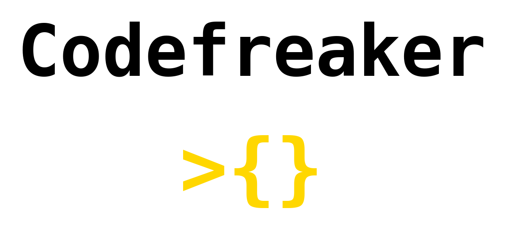

<p align="center">
  
</p>
<p align="center">
    <em>The go-to CLI tool for competitive programmers and setters.</em>
</p>
<p align="center">
	<!-- local repository, no metadata badges. -->
<p>
<p align="center">
		<em>Developed with the software and tools below.</em>
</p>
<p align="center">
	
	
	
	
</p>

<br><!-- TABLE OF CONTENTS -->
<details>
  <summary>Table of Contents</summary><br>

- [ Overview](#-overview)
- [ Features](#-features)
- [ Repository Structure](#-repository-structure)
- [ Modules](#-modules)
- [ Getting Started](#-getting-started)
  - [ Installation](#-installation)
  - [ Usage](#-usage)
  - [ Tests](#-tests)
- [ Project Roadmap](#-project-roadmap)
- [ Contributing](#-contributing)
- [ License](#-license)
- [ Acknowledgments](#-acknowledgments)
</details>
<hr>

##  Overview

[](https://github.com/rsalesc/codefreaker/blob/master/LICENSE)
[](https://pypi.python.org/pypi/codefreaker/)
[](https://pypi.python.org/pypi/codefreaker/)

Codefreaker is a CLI tool and library that aims to help contestants and setters from the competitive programming community to have an easier time.

Although trying to solve the issues of these two audiences seems to be too much for a single tool to handle, we exploit the fact that the journeys of contestants and setters have a lot in common.

---

##  Features

#### For contestants

- 🤖 **Parsing**: provides an entrypoint for contests and problems to be parsed through Competitive Companion.
- 🔨 **Testing**: provides commands for automatically running your problems against both downloaded and manually added testcases, and shows a clear report.
- 📤 **Submit**: provides the option of submiting your solution for a few supported online judges from the command line.
- 🧱 **Structure**: provides an opinionated structure for the file tree of both parsed and manually created problems.
- ⚙️ **Flexibility**: still gives enough flexibility for you to extend your problem. Add testcases, set a custom checker, write a generator.

#### For setters

🔜 Still coming up!

---

##  Getting Started

**System Requirements:**

* **Python**: `version 3.10`

###  Installation

#### From `pip`

> [](https://https://pypi.org/)
> ```console
> $ pip install codefreaker
> ```

#### From code

> Go to the cloned folder and run:
> ```console
> $ pip install .
> ```

#### In Poetry venv (while developing)

> Run the following when in the Poetry venv.
> ```console
> $ poetry install
> ```


###  Usage

TODO 

###  Tests

TODO

---

##  Project Roadmap

TODO

---

##  Contributing

Contributions are welcome! Here are several ways you can contribute:

- **[Report Issues](https://local//issues)**: Submit bugs found or log feature requests for the `.` project.
- **[Submit Pull Requests](https://local//blob/main/CONTRIBUTING.md)**: Review open PRs, and submit your own PRs.
- **[Join the Discussions](https://local//discussions)**: Share your insights, provide feedback, or ask questions.

<details closed>
<summary>Contributing Guidelines</summary>

1. **Fork the Repository**: Start by forking the project repository to your local account.
2. **Clone Locally**: Clone the forked repository to your local machine using a git client.
   ```sh
   git clone ../.
   ```
3. **Create a New Branch**: Always work on a new branch, giving it a descriptive name.
   ```sh
   git checkout -b new-feature-x
   ```
4. **Make Your Changes**: Develop and test your changes locally.
5. **Commit Your Changes**: Commit with a clear message describing your updates.
   ```sh
   git commit -m 'Implemented new feature x.'
   ```
6. **Push to local**: Push the changes to your forked repository.
   ```sh
   git push origin new-feature-x
   ```
7. **Submit a Pull Request**: Create a PR against the original project repository. Clearly describe the changes and their motivations.
8. **Review**: Once your PR is reviewed and approved, it will be merged into the main branch. Congratulations on your contribution!
</details>

<details closed>
<summary>Contributor Graph</summary>
<br>
<p align="center">
   <a href="https://local{//}graphs/contributors">
      
   </a>
</p>
</details>

---

##  License

This project is protected under the [Apache License 2.0](http://www.apache.org/licenses/) License. For more details, refer to the [LICENSE](LICENSE) file.

---

[**Return**](#-overview)

---
